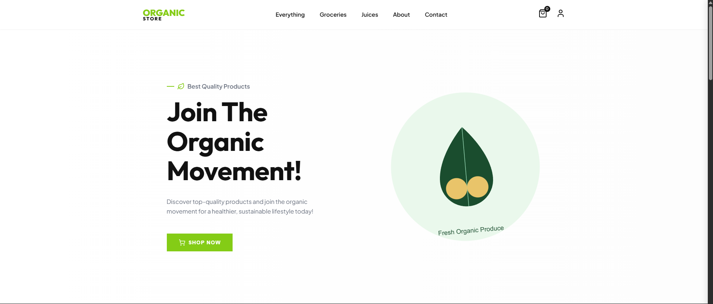
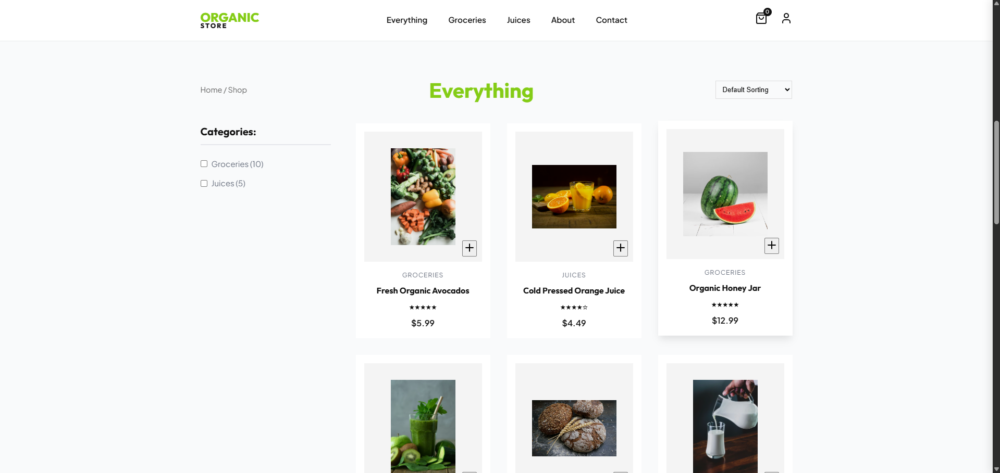
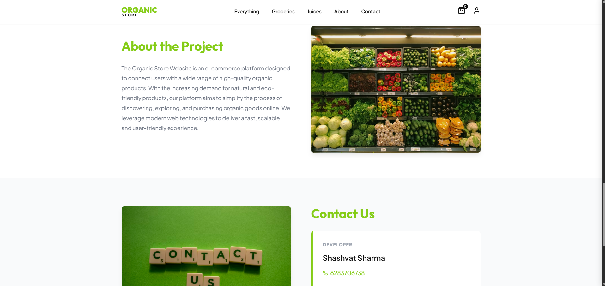
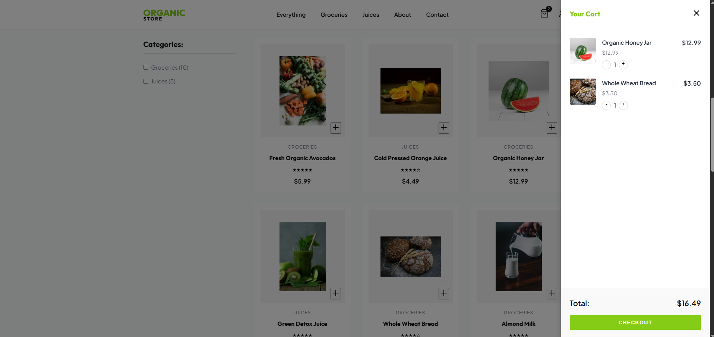

# Organic Store 🌱

A cloud-based Organic Store application that provides a seamless platform for browsing and purchasing fresh, chemical-free products. The system uses scalable cloud infrastructure to ensure availability, reliability, and smooth user experience.

---

## 🚀 Features

- Online browsing of organic products
- Clean and user-friendly interface
- Cloud-based deployment for scalability
- Secure and efficient data handling
- Easily extendable with payment and delivery modules

---

## 🛠️ Technologies Used

- Python  
- Cloud Computing  
- HTML, CSS  
- Flask (optional)  
- AWS / Cloud Platform  

---

## 📂 Project Structure

organic_store/
├── app.py
├── data/
├── images/
├── requirements.txt
├── setup.sh
├── .gitignore
└── README.md

---

## 🖼️ Screenshots

### Home Page


### Products Page


### Cart Page


### Checkout Page


---
## ⚙️ Installation

```bash
git clone https://github.com/Shashvat183/organic_store.git
cd organic_store
pip install -r requirements.txt
python app.py
👤 Author

Shashvat Sharma
📧 Email: shashusharma145@gmail.com

🔗 GitHub: https://github.com/Shashvat183

